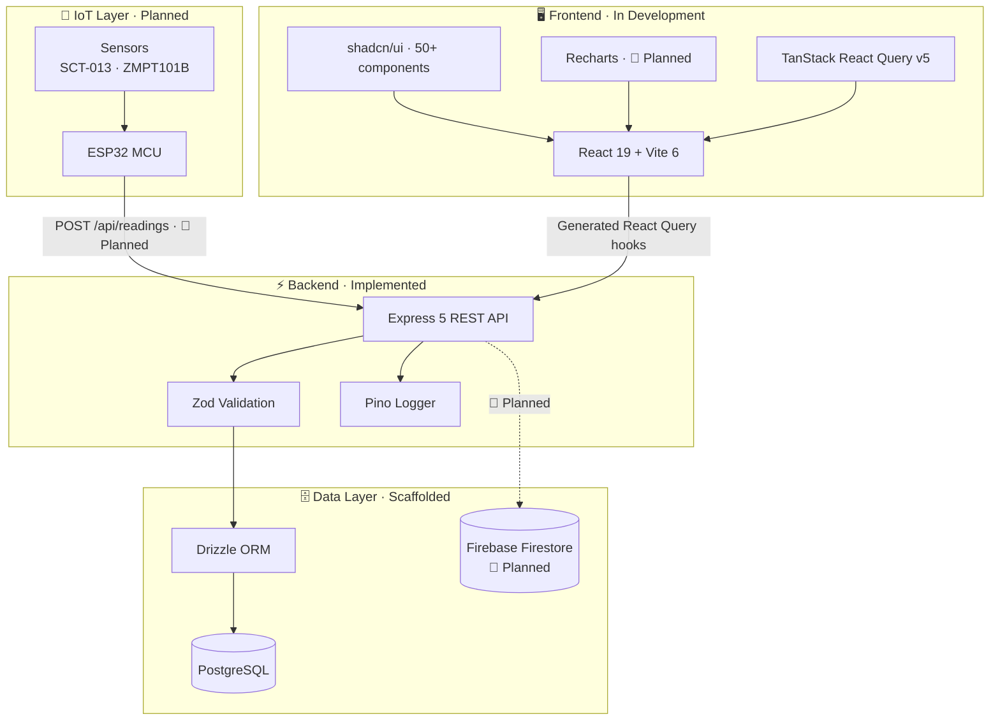
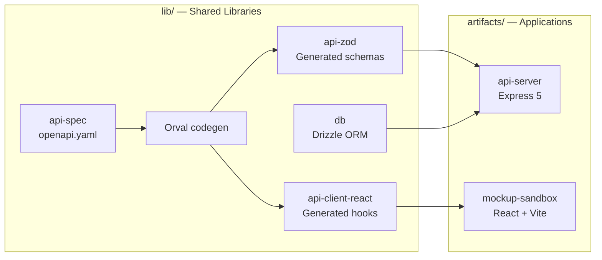
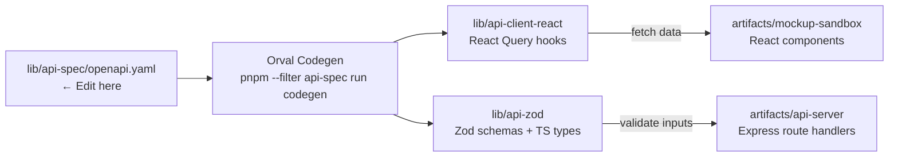
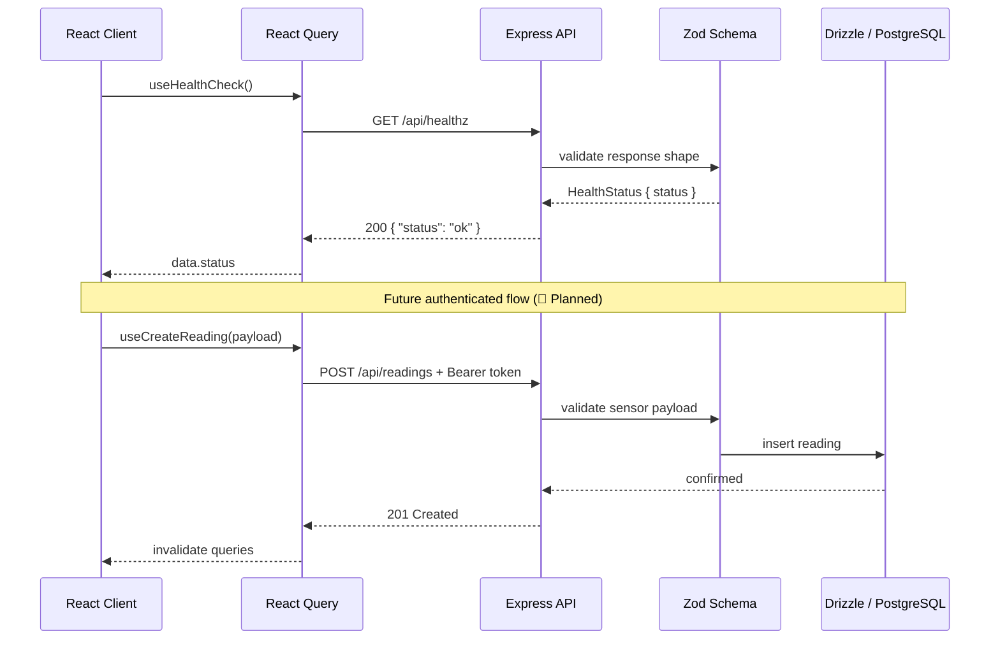
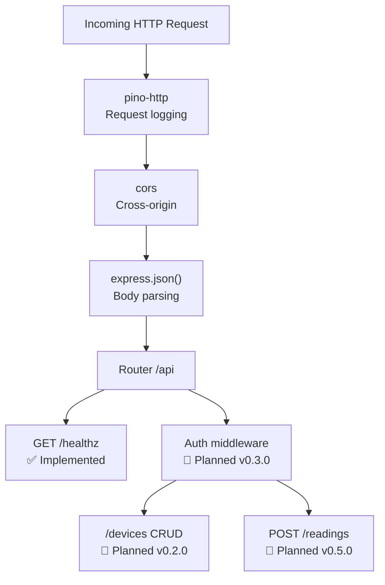
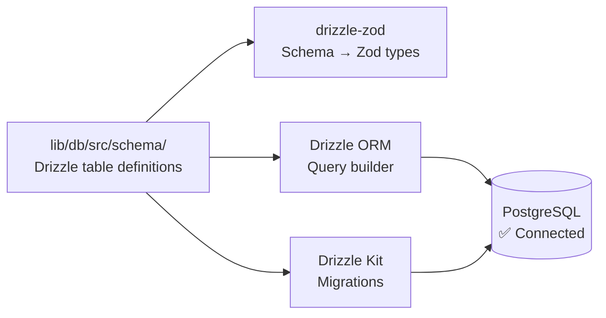

# Architecture — EcoSwitch AI

> Reflects the actual codebase as of v0.1.0. Planned components are clearly labelled.

---

## System Architecture



---

## Monorepo Layout



| Package | Path | Role |
|---------|------|------|
| `@workspace/api-server` | `artifacts/api-server/` | Express 5 REST API — the only deployable backend |
| `@workspace/mockup-sandbox` | `artifacts/mockup-sandbox/` | React + Vite component sandbox (dev only) |
| `@workspace/api-spec` | `lib/api-spec/` | OpenAPI 3.1 spec + Orval codegen config |
| `@workspace/api-client-react` | `lib/api-client-react/` | **Generated** React Query hooks (do not edit) |
| `@workspace/api-zod` | `lib/api-zod/` | **Generated** Zod schemas + TypeScript types (do not edit) |
| `@workspace/db` | `lib/db/` | Drizzle ORM schema, migrations, DB client |
| `@workspace/scripts` | `scripts/` | Utility scripts |

**Rules:**
- `artifacts/*` packages must never import from each other — shared logic lives in `lib/*`
- Generated packages (`api-client-react`, `api-zod`) must never be edited manually — regenerate with codegen
- `lib/*` packages are composite TypeScript (emit declarations); `artifacts/*` are leaf packages (no emit)

---

## Contract-First API Design



**Workflow:**
1. Design the endpoint in `openapi.yaml` first
2. Run codegen — hooks and schemas appear automatically
3. Implement the Express route handler using the generated Zod schema for validation
4. The frontend consumes the generated React Query hook — no manual type copying

---

## API Request Lifecycle



---

## API Server Internal Structure



**Files:**

| File | Purpose |
|------|---------|
| `index.ts` | Process entry point — binds to `process.env.PORT` |
| `app.ts` | Express factory — registers middleware and router |
| `routes/index.ts` | Route aggregator — mounts all sub-routers |
| `routes/health.ts` | `GET /api/healthz` handler |
| `middlewares/` | Empty — ready for auth, rate-limiting |
| `lib/logger.ts` | Pino singleton — use `req.log` in handlers |

---

## Data Layer

**Path:** `lib/db/`



- **ORM:** Drizzle ORM with `drizzle-orm/node-postgres`
- **Migrations:** Drizzle Kit (`push` for dev, `generate`+`migrate` for production)
- **Schema validation:** `drizzle-zod` generates Zod schemas from Drizzle table definitions
- **Current state:** Connection configured; no tables defined yet (v0.2.0)

**Adding a new table:**
```typescript
// lib/db/src/schema/devices.ts
import { pgTable, text, serial, timestamp } from "drizzle-orm/pg-core";
import { createInsertSchema } from "drizzle-zod";
import { z } from "zod/v4";

export const devicesTable = pgTable("devices", {
  id:        serial("id").primaryKey(),
  name:      text("name").notNull(),
  userId:    text("user_id").notNull(),
  createdAt: timestamp("created_at").defaultNow().notNull(),
});

export const insertDeviceSchema = createInsertSchema(devicesTable).omit({ id: true });
export type InsertDevice = z.infer<typeof insertDeviceSchema>;
export type Device = typeof devicesTable.$inferSelect;
```

---

## Planned Additions

### Firebase (v0.3.0)
- Firebase Auth replaces the `setAuthTokenGetter` stub in `custom-fetch.ts`
- Firebase Firestore for real-time readings (alongside PostgreSQL)
- Firebase Cloud Messaging for push notifications

### IoT Ingestion (v0.5.0)
- `POST /api/readings` — accepts and validates ESP32 sensor payloads
- Writes to PostgreSQL time-series table via Drizzle

### PWA (v0.7.0)
- Web App Manifest + Service Worker (Workbox)
- Offline read-only dashboard with background sync

---

## TypeScript Configuration

| File | Role |
|------|------|
| `tsconfig.base.json` | Shared strict defaults (ESNext, `bundler` module resolution) |
| `tsconfig.json` (root) | Solution file for composite `lib/*` packages only |
| Each package `tsconfig.json` | Extends base; `artifacts/*` use `noEmit: true` |

**Do not** add `artifacts/*` to the root `tsconfig.json` references — that file is for buildable libs only.
